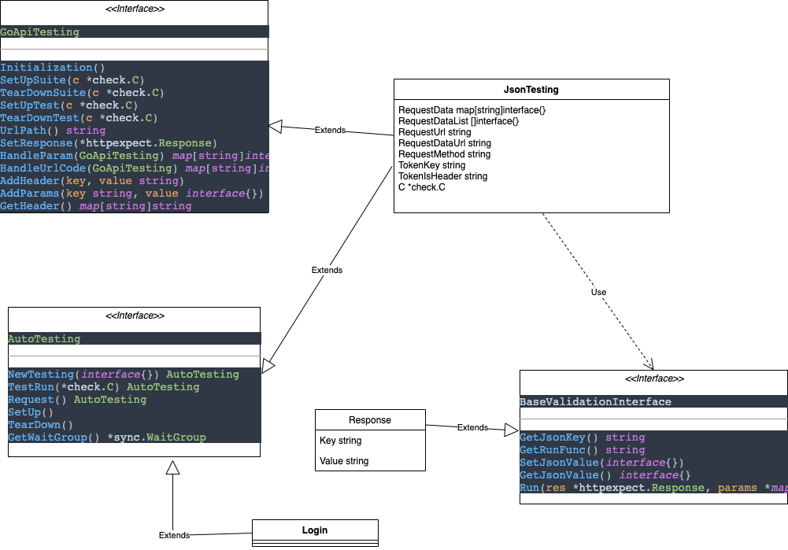

# 接口测试

## 执行  
* 根目录执行
```
go test
```

## 编写测试用例
* <a href="#结构体创建">结构体 </a>
* <a href="#Json创建">json </a>
* <a href="#GroupJson创建">GroupJson </a>


## 结构体创建
<a name="1">结构体创建</a>
1. 实现接口 AutoTesting
2. 继承BaseJccAPITesting  方便实现些可必须的方法
3. 在实现结构体下创建 前缀为 `Test` 方法
```
package model

import (
	"gopkg.in/check.v1"
	"jccAPITest/common"
)

type Login struct {
	Username string `json:"username"`
	Password string `json:"pwd"`
	common.BaseJccAPITesting
}

func init() {
	common.RegisterCheck(new(Login))
}

func (l *Login) UrlPath() string {
	return "manager/pm_user/user_login"
}

func (l *Login) TestLoginError(c *check.C) {
	l.Username = "admin"
	l.Password = "23232"
	res := common.HttpPost(c, l)
	ob := res.JSON().Object()
	// fmt.Println("---------------" + fmt.Sprint(ob) + "---------------")
	ob.Value("msg").Equal("密码不正确")
}

func (l *Login) TestLoginSuccess(c *check.C) {
	// common.ParamByJson(l, common.RootPath+ "/json/login.json")
	l.Username = "admin"
	l.Password = "jcc2018"
	// fmt.Println("------ParamByJson---------" + fmt.Sprint(l) + "---------------")
	res := common.HttpPost(c, l)
	ob := res.JSON().Object()
	// fmt.Println("---------------" + fmt.Sprint(ob) + "---------------")
	ob.Value("token").NotNull()
}

```
## Json创建
<a name="2">Json创建</a>
1. 在配置的指定route目录中创建json文件 编写对应的请求地址和请求参数  自动执行
```
[
  {
    "request_url": "manager/pm_user/user_login",  // 请求地址
    "request_data_url": "login.json",             // 请求数据地址 (目录在配置中配置)
    "type": "Post",                               // 请求方式 
    "addr": "PmToken"                             // 权限验证 
    "request_data": [{
                "username": "丛力强",
                "pwd": "123",
                "response" : "操作成功"
              },
              {
                "username": "丛力强1",
                "pwd": "1232",
                "response" : "用户不存在"
              }
            ]},                                     // 请求参数  可写在对应文件中  2数据会合并
  {
    "request_url": "manager/pm_member/select_members",
    "request_data_url": "select_member.json",
    "type": "Get",
    "addr": "PmToken"
  }
]

```

## GroupJson创建
<a name="1">GroupJson创建</a>
1. 基础配置与上述一致 区别在于  一个测试用例必须写在同一个文件中 
> 一个用例可以请求多个接口  前置接口为后续接口获取参数
```
[
  {
    "request_url": "manager/pm_user/user_login",  // 请求地址
    "request_data_url": "login.json",             // 请求数据地址 (目录在配置中配置)
    "type": "Post",                               // 请求方式 
    "addr": "PmToken",                            // 权限验证 
    "after": {
        "token":"token",
        "goods_id": "data.goods_id",
    }                                             // 从返回值中向后传递的值 
    "request_data": [{
                "username": "丛力强",
                "pwd": "123",
                "response" : "操作成功"
              },
              {
                "username": "丛力强1",
                "pwd": "1232",
                "response" : "用户不存在"
              }
            ]},                                     // 请求参数  可写在对应文件中  2数据会合并
  {
    "request_url": "manager/pm_member/select_members",
    "request_data_url": "select_member.json",
    "type": "Get",
    "addr": "PmToken",
    "request_data": [{
      "username": "before",
      "pwd": "123",
      "response" : "操作成功"
    }},         
  }
]

```

## 自定义验证标签
> 指定的json键值 执行 对应的回调方法
> 只需实现 BaseValidationInterface
```
package validation

import (
	"github.com/gavv/httpexpect"
	"jccAPITest/common"
)

func init() {
	Register(new(Response))
}

/**
 * 返回匹配
 * @Author: cs_shuai
 * @Date: 2020-08-10
 */
type Response struct {
	Key   string
	Value interface{}
}

func (r *Response) GetJsonKey() string {
	r.Key = "response"
	return r.Key
}

func (r *Response) GetRunFunc() string {
	return TearDownTest
}

func (r *Response) SetJsonValue(value interface{}) {
	r.Value = value
}

func (r *Response) GetJsonValue() interface{} {
	return r.Value
}

func (r *Response) Run(res *httpexpect.Response, params *map[string]interface{}) {
	responseKey := common.ResponseKey
	response := common.Response
	equalValue := "成功"
	var tempMap = *params
	if value, ok := tempMap[response]; ok {
		equalValue = value.(string)
	}
	params = &tempMap
	res.JSON().Object().Value(responseKey).Equal(equalValue)
}

```

## 测试UML图
